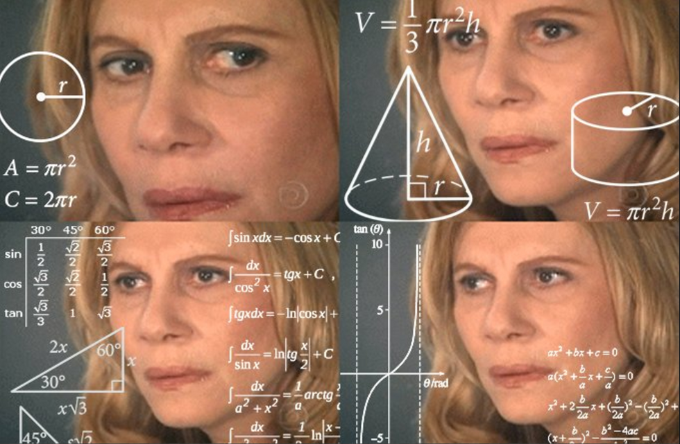

# fantasy-analysizer



Deployed with netlify: https://pulpfantasypointpotiental.netlify.app/

Pulpmx fantasy motocross utilizes a handicap scoring system that can be intimidating for beginners. This project shows the point potential for each handicap and allstar status possibility.

## Build Setup

```bash
# install dependencies
$ npm install

# serve with hot reload at localhost:3000
$ npm run dev

# build for production and launch server
$ npm run build
$ npm run start

# generate static project
$ npm run generate
```

## Tools used

Nuxt, Tailwind, Netlify. Learned a lot about Nuxt with this project, even though it behaves like a SPA.
